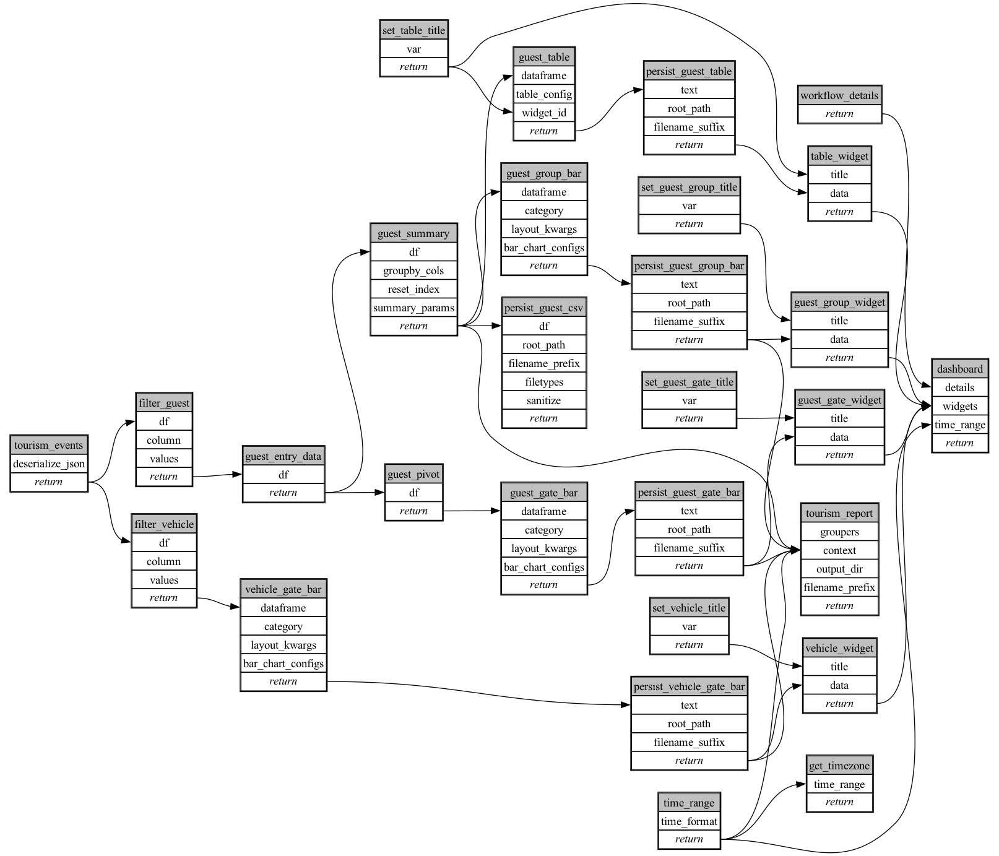

```
# AUTOGENERATED BY ECOSCOPE-WORKFLOWS; see fingerprint in README.md for details

```

```yaml
# fingerprint:
artifacts_sha256_basic: 6aa70c9e259edc018738b23424ee360854de8e3e001629c720af2aaebc374e2b
artifacts_sha256_strict: 496ee80e464c02d4f313a00c815def9df2119b6595811583771e280176b897fe
installed_requirements:
- channel: https://repo.prefix.dev/ecoscope-workflows/
  name: ecoscope-workflows-core
  version: {version: ==0.22.18}
- channel: https://repo.prefix.dev/ecoscope-workflows/
  name: ecoscope-workflows-ext-ecoscope
  version: {version: ==0.22.18}
- channel: file:///tmp/ecoscope-workflows-custom/release/artifacts/
  name: ecoscope-workflows-ext-custom
  version: {version: ==0.0.41}
- channel: file:///tmp/ecoscope-workflows-custom/release/artifacts/
  name: ecoscope-workflows-ext-mt
  version: {version: ==0.0.2}
- channel: https://repo.prefix.dev/ecoscope-workflows-custom/
  name: pydeck
  version: {version: ==0.9.1a2}
params_sha256: 7d5cdedb07f2cb6c69bf467b01756971f0986f8584432c00600143c1131c2c75
spec_sha256: 0bf3976bf9af61f370c7d6e11e1220db761437bf9bd6af74803de0c9b9defaa6

```

# ecoscope-workflows-mt-tourism-workflow


